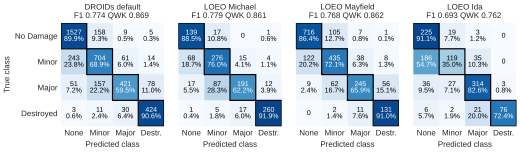

# Mask Centered Damage Net (MCDN)

[](https://www.python.org/)
[](https://github.com/astral-sh/uv)
[](https://github.com/astral-sh/ruff)
[](https://pytorch.org/)
[](https://docs.pytest.org/en/stable/)
<!-- Live badge; re-enable once the repo is public:
[](https://docs.pytest.org/en/stable/) -->

[](https://huggingface.co/mobilesensorlab/mcdn)

[](./LICENSE.md)

Mask Centered Damage Net (MCDN) is a **~33.5M**-parameter unitemporal structural damage classifier designed for use on sUAS orthomosaics, built on a 
**[ConvNeXt v2 Nano](https://huggingface.co/timm/convnextv2_nano.fcmae_ft_in22k_in1k)** backbone. 
It grades individual structures on the four-level Joint Damage Scale (*No Damage*, *Minor*, *Major*, *Destroyed*) using only a post-disaster sUAS orthomosaic and
a cache of building footprints, with no pre-disaster imagery.

Most automated damage assessment is bitemporal: a Siamese network compares pre- and post-event satellite imagery and grades the change.
Applied to sUAS post-disaster imagery, a bitemporal approach assumes a pre-event raster can be delivered to the point of analysis, which a disaster zone with 
degraded communications generally cannot do, and would struggle to compare a sub-5 cm/px sUAS ortho to a satellite (30–80 cm/px) or crewed (15–30 cm/px) prior.
MCDN replaces the need for a pre-event raster with the structure footprint, a vector prior that is small enough to cache on a field laptop in advance and 
already exists for most of the built world.
This footprint serves two functions. First, it localizes: it centers each of MCDN's input chips on the structure being evaluated.
Second, it directs attention: the rasterized mask is ingested as a fourth input channel and separately weights the model's spatial pooling, so that features under
the roof dominate the pooled representation and surrounding debris contributes less. 

A FiLM gate conditions the head on disaster typology, since the same visual evidence carries different meaning after a tornado than 
after a flood, and a squared Earth Mover's Distance loss preserves the ordinal structure of the grades, penalizing a two-grade error more than a one-grade error.

MCDN is trained and evaluated on
**[CRASAR-U-DROIDs](https://huggingface.co/datasets/CRASAR/CRASAR-U-DROIDs)**, a sUAS damage-annotation dataset assembled from incident-response flights.

## Headline Performance

MCDN was evaluated on four holdouts.
The first is CRASAR-U-DROIDs' default train/test split, which already separates different events into each pool to avoid inflated performance metrics from autocorrelation. 
MCDN is then evaluated on three Leave One Event Out (LOEO) holdouts which each withhold a single event.
Per-seed columns are mean ± SD over ten seeds; ensemble columns average those ten networks under 8-view D4 test-time augmentation.

| Holdout | Per-seed QWK | Per-seed Macro-F1 | Ensemble QWK | Ensemble Macro-F1 |
|---|:---:|:---:|:---:|:---:|
| DROIDs default split | 0.865 ± 0.002 | 0.768 ± 0.007 | **0.869** | **0.774** |
| LOEO Hurricane Michael | 0.861 ± 0.005 | 0.779 ± 0.005 | **0.861** | **0.779** |
| LOEO Mayfield Tornado | 0.849 ± 0.007 | 0.751 ± 0.014 | **0.862** | **0.768** |
| LOEO Hurricane Ida | 0.752 ± 0.010 | 0.686 ± 0.008 | **0.762** | **0.693** |



Three of the four holdouts fall within 0.01 of one another.
Hurricane Ida is the exception, and its deficit traces to a single class boundary: most of Ida's severe errors are structures with intact roofs surrounded by storm
surge, labeled *Minor* or *Major* for damage to the interior and lower structure that a nadir roof view does not show, so the model under-grades them as *No Damage*.
Across all holdouts, errors concentrate on adjacent grades; on the default split, 727 of 820 errors are one grade off while only 93 (2.4% of structures) are two or more.

State-of-the-art bitemporal approaches on the **[xBD / xView2 dataset](https://xview2.org/dataset)** report Macro-F1 of 0.75–0.80 when training and test pools share events and 0.51–0.57 
when events are withheld, with most of that loss in the *Minor* and *Major* grades. 
MCDN's event-disjoint scores are highly competitive with bitemporal methods' event-overlapping band, with *Minor* and *Major* F1 remaining near 0.7 on three of the four holdouts.

**Ensemble and throughput.** A single MCDN network without test-time augmentation scores within 0.02 QWK of the ten-seed ensemble on every holdout; ensembling
contributes seed-to-seed stability more than accuracy.
On a desktop RTX 5090 a single network grades about 830 structures per second (108 with TTA) and the full 80-pass ensemble just under 10, with peak GPU memory 
at or below 3.3 GB, roughly half the VRAM of a 2021 laptop RTX 3060.
On that laptop, the 1,110-structure Hurricane Michael holdout takes under two minutes for a single network with TTA and 15–19 minutes for the full ensemble.

**Footprint misalignment.** Public footprint caches are often imperfectly aligned to post-event imagery; **[CRASAR-U-DROIDs](https://huggingface.co/datasets/CRASAR/CRASAR-U-DROIDs)** 
supplies tie-point corrections that move each Microsoft polygon onto its structure (by 2.5 m on average). 
Evaluated on the uncorrected polygon footprints without retraining, the MCDN ensemble loses at most 0.025 QWK on any holdout.
Under controlled translation, performance is flat to about 2.5 m and degrades gradually beyond it: 0.02–0.06 QWK at 5 m and 0.08–0.17 at 8 m.

## Installation

### Training Requirements

- **High-Performance GPU**: A CUDA-capable GPU with support for **[Automatic Mixed Precision (AMP)](https://docs.pytorch.org/docs/stable/amp.html)** operations and **+24GB of VRAM**, such as an NVIDIA
RTX 3090/4090/5090 or equivalent. MCDN may still be trained on less robust GPUs but will require **[configuration](config/config.yaml)** adjustments.
- **uv**: You must have **[uv](https://github.com/astral-sh/uv)**  installed.
  - **Windows**: `powershell -c "irm https://astral.sh/uv/install.ps1 | iex"`
  - **macOS/Linux**: `curl -LsSf https://astral.sh/uv/install.sh | sh`
  - Or via pip: `pip install uv`

### Software Setup

1.  **Clone the repository**: 
    ```bash
    git clone https://github.com/MobileSensorLab/mcdn.git
    cd mcdn
    ```


2.  **Initialize the environment:** Run the following command to sync the project dependencies and set up the virtual environment to automatically install 
the required Python version and packages: 

    ```bash
    uv sync
    ```

    On **Linux**, PyTorch backends are opt-in extras: use `uv sync --extra cu128` for CUDA machines (e.g. A100/H100 nodes) or `uv sync --extra cpu` for 
    CPU-only environments such as CI. Windows resolves its CUDA wheels automatically and needs no extra.


3.  **Activate the environment:**
    To use the environment in your shell:
    - **Windows**: `.venv\Scripts\activate`
    - **macOS/Linux**: `source .venv/bin/activate`

### Data Setup

This project relies on the **[CRASAR-U-DROIDs](https://huggingface.co/datasets/CRASAR/CRASAR-U-DROIDs)** dataset, which is hosted on Hugging Face and needs no account to download. 
The full repository is ~219 GB, but MCDN only trains on the sUAS subset (~196 GB); the crewed-aircraft subset (~11.5 GB) is needed only for the `resolution` ablation
arm, and the satellite subset is unused. 

**Option A: fetch script.** From the activated environment:

```bash
python -m scripts.fetch_dataset --list                          # inventory by split and sensor, with on-disk status
python -m scripts.fetch_dataset                                 # sUAS train + test (~196 GB)
python -m scripts.fetch_dataset --sensor uas --sensor crewed    # add the crewed-aircraft subset for the resolution arm
python -m scripts.fetch_dataset --sensor uas --split test       # test pool only (~66 GB)
```

Downloads are parallel and resumable; files already present at the published size are skipped, so an interrupted run can simply be re-launched. The
`statistics.csv` and `format/` files that the sampler depends on are always included, and `data/readme/` is never touched. The last command is the light-weight
path for reproducing the published metrics without training: pair it with `scripts.fetch_checkpoints` (below) and run the ensemble step against the test pool.
An optional Hugging Face token (`--token-file` or the `HF_TOKEN` environment variable) lifts the Hub's unauthenticated rate limit.

**Option B: manual download.** Download the dataset from the **[CRASAR-U-DROIDs repository page](https://huggingface.co/datasets/CRASAR/CRASAR-U-DROIDs)**
(at minimum `statistics.csv`, `format/`, and the `UAS` imagery and annotations under both `train/` and `test/`) and copy it into `data/` at the root of this
repository, preserving the repository's own directory structure and leaving the pre-existing **[data/readme](data/readme)** folder in place.

Either way, the result should look like this:

```text
mcdn/
├── data/
│   ├── readme/                  # repository assets (badges, figures); keep
│   ├── statistics.csv           # per-orthomosaic event and sensor metadata (required)
│   ├── format/                  # annotation schema files (required)
│   ├── train/
│   │   ├── imagery/UAS/         # training orthomosaics (GeoTIFF)
│   │   └── annotations/UAS/     # damage labels and footprint alignment adjustments
│   └── test/
│       ├── imagery/UAS/
│       └── annotations/UAS/
├── src/
├── pyproject.toml
├── README.md
└── ...
```

Crewed-aircraft and satellite data, if fetched, sit beside `UAS/` as `CREWED/` and `SATELLITE/` under the same `imagery/` and `annotations/` directories.

## Usage

### Train a ten-seed pool

The ablation presets live under `config/presets/` and are selected by name with `--ablation-preset`:

| Arm | Configuration |
|---|---|
| `all_features` | Full configuration: mask channel, mask-weighted pooling, typology FiLM, squared EMD loss with adjacency-aware smoothing |
| `rgb_only` | ConvNeXt v2 on the footprint-centered RGB chip alone (no mask channel, no mask pooling, no typology) |
| `mask_channel_only` | RGB + footprint as a fourth input channel |
| `pooling_only` | RGB + mask-weighted pooling |
| `pooling_typology` | RGB + mask-weighted pooling + typology FiLM |
| `mask` | Full configuration minus the footprint (channel and pooling) |
| `typology` | Full configuration minus typology FiLM |
| `no_smoothing` | Full configuration with hard ordinal targets |
| `ce_loss` | Full configuration under cross-entropy instead of squared EMD |
| `resolution` | Full configuration trained and evaluated on DROIDs' crewed-aircraft imagery (15–30 cm/px) |

To launch the full ten-seed pool for one arm on one holdout:

```bash
python train.py --ablation-preset all_features --fixed-seeds --holdout-event "Hurricane Michael"
```

`--fixed-seeds` runs the 10-seed protocol (0, 11, 22, 33, 44, 55, 66, 77, 88, 99). `--holdout-event` takes one event name for a LOEO fold or a `+`-joined
composite; the CRASAR-U-DROIDs default split is the composite `"Hurricane Idalia+Hurricane Michael+Mayfield Tornado+Mussett Bayou Fire"`. Outputs land under
`outputs/ablation/<arm>/<holdout>/seed_<NN>/` (best-checkpoint weights, training log, per-seed metrics, resolved config); spaces in the holdout name become
underscores in the directory name. Use `--seeds N [N ...]` instead of `--fixed-seeds` to run a custom seed list, or `--config <path>` to bypass the preset
machinery entirely.

### Generate ensemble probabilities and ensemble metrics

Once all seeds in a pool finish, run:

```bash
python -m src.postproc.ensemble \
    --variant-roots outputs/ablation/all_features \
    --split Hurricane_Michael \
    --data-dir data \
    --prob-cache outputs/ablation/_ensembles/all_features__Hurricane_Michael_probs.pt \
    --output-json outputs/ablation/_ensembles/all_features__Hurricane_Michael.json
```

This caches the per-chip 8-view D4 TTA softmax stacks to the `_probs.pt` file and writes the JSON with argmax / EV / hybrid scores under each prediction rule.
The published ensemble results in `outputs/ablation/_ensembles/` follow this `<arm>__<holdout>` naming.

### Fetch the published checkpoints

Trained weights are not tracked in git. Every `best_model.pt` behind the paper (370 checkpoints: ten seeds per arm and holdout, ~43 GB) is published in the [`mobilesensorlab/mcdn`](https://huggingface.co/mobilesensorlab/mcdn) model repository on Hugging Face, in a tree that mirrors `outputs/ablation/`. Fetch what you need into place:

```bash
python -m scripts.fetch_checkpoints --list                                    # cells, sizes, and on-disk status
python -m scripts.fetch_checkpoints --arm all_features --fold Hurricane_Michael
python -m scripts.fetch_checkpoints --all                                     # the whole pool
```

Downloads are parallel and resumable, every checkpoint is verified against the repository's `MANIFEST.json` SHA-256, and files already present are skipped.
Each published seed directory also carries the `config_resolved.yaml` it trained under (with run-bookkeeping paths normalized to this repository's layout); it is
only downloaded where a clone does not already track one.

### Reproduce the full ablation matrix

The nine sUAS arms × four holdouts × ten seeds compose to 360 runs; the crewed-aircraft `resolution` arm adds ten more on the Michael holdout, for 370
runs in total. The matrix was trained as a SLURM job array: `scripts/cluster/make_job_manifest.py` emits one `preset  holdout  seed` line per run and
`scripts/cluster/train_array.sbatch` consumes it, with `train.py --skip-if-complete` making resubmission idempotent. Every run's per-seed `metrics.json`
and `config_resolved.yaml` are tracked in this repository under `outputs/ablation/<arm>/<holdout>/seed_<NN>/`; the weights are fetched as described above.

## Citation

The accompanying manuscript, *Mask Centered Damage Net: Building Damage Classification from Unitemporal sUAS Imagery and Footprint Priors*
(A. Kaplan and E. Best, Mobile Sensor Lab, University at Albany), is under review at IEEE JSTARS. Until it is published, please cite this repository and the
Hugging Face model repository; a DOI and BibTeX entry will be added here on acceptance.

## License

This project is licensed under the GNU Affero General Public License v3.0. Please see [LICENSE.md](LICENSE.md) for details.
